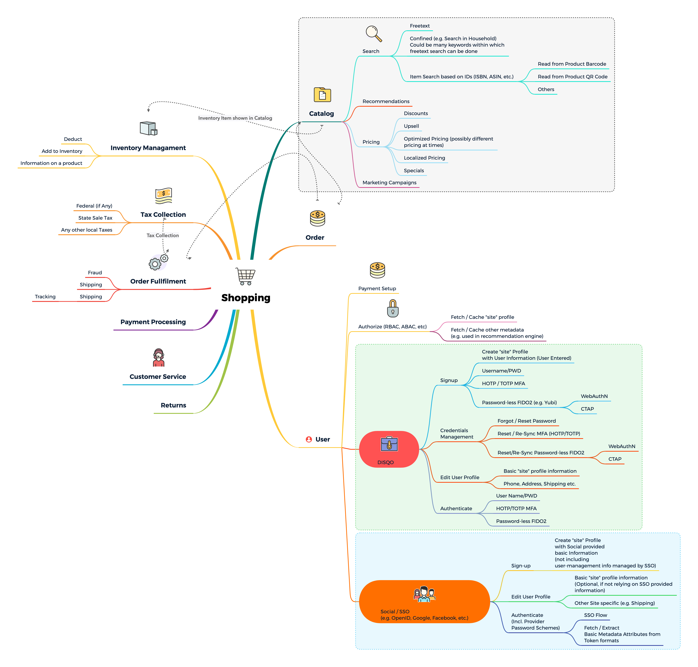
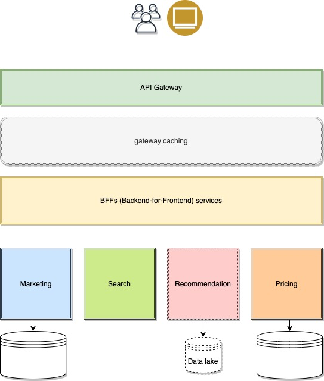
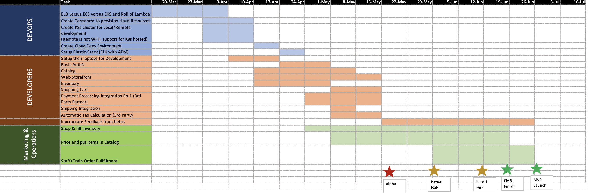

# A note before I begin

---

It has been a truly crazy week for me. So much happened unexpectedly that my head is spinning and thus I couldn't plan any substantial time for this exercise and the deadline is past due. When I was assigned this exercise, I was just coming out of sickness (cold or mild-flu). That's when I requested an extension over the weekend. Within the first few days after that my wife fell sick. That itself threw quite a bit of wrinkles in our lives.

The next big blow came when my young son fell ill (and he still is--though not from COVID-19). Per the guidelines, we all had to self-quarantine. Our lives have been thrown upside down between making rounds to shops and grocery stores to standing in lines for hours on end. The work-from-home policy was a bit difficult to implement, especially for people in India.

_Having said that, I cannot just claim all this doom and gloom caused me to not do my best_. I have a relatively good experience with Kubernetes, Docker and other dev, CI/CD tools (such as Skaffold or Draft). I thought that it would be a great opportunity to show up some skills. I was cautiously ambitious until I couldn't control the time I devoted. I cannot help but think that I could have managed it better.

As I have mentioned before, I am very excited for this opportunity and would be extremely disappointed if this perfect storm causes my candidacy to get derailed. If I do end up missing the boat, I apologize for wasting your time. Right now it's Monday 5:25AM in the morning and I haven't slept for the past 32hrs, and my mind cannot think anymore! I created an inline task list here and am trying to check them one by one. I will send what I have now, and will continue to work on this even if you take me off the table.

# A Hypothetical Shopping Experience

## The Exercise

The goal of the take-home exercise as I understood it is to evaluate Project Management, Strategy, (some) Product Management, Technical Architecture, Design, Development and hands-on capabilities including on DevOps. To create a framework, I separated the objectives into 2 broad sections. Ones that are checked are done (at least as draft-0):

### Product Ownership, Strategy, Planning

- [x] A quick back of the napkin brainstorming/mind-mapping of the domain under consideration. At the very least, it pointed out the complexities of the experience of shopping and fulfillment and generally running a self built e-commerce shop.
- [x] A high level mapping of the domain to a set of Microservices:
  - [x] Interaction among them describing the "core" activity of shopping for goods and placing an order
  - [x] Anything other than that (e.g. Inventory Management) is out of scope.
  - [ ] Pay special focus to Authentication and Item Search service.
- [ ] A set of KPIs to measure the success of the roadmap **as we progressed on the roadmap**
      

### Technical Management & Development, Deployment etc (DevSecOps)

- [x] A prioritized high-level Technical Roadmap and Release Planning for building these microservices
- [ ] A high level architectural layout plan (logically, not showing core physical tools such as Networks, Load balancers, etc.--relying instead on SDNs and mesh sidecars)
- [ ] A high level technical specifications documents for each Microservice
  - [ ] Tooling, framework, etc.
  - [ ] Open API 3 definitions of the Microservices, and host on swagger hub or as a self contained docker image.
  - [ ] A database schema for each Microservice
- [ ] Implement a Java8+ based authentication (and authorization ; remember identification != permissions) system

---

## The big picture

Before I started out, I just wanted to create a mental model of what it would be like to make an eCommerce site. Granted it was probably not part of the exercise, it did reveal some interesting challenges. For example, should the notion of "Fraud detection & Prevention" be it's own microservice. For now, I left these thoughts on the table.

---

## An approach to Authentication (and Authorization) services

We live in a world where stolen identities are a common norm. Besides, in the world of open source development, the greater the eyes are on any security implementation, the more secure it is likely to be. Closed source schemes are not vetted and can be broken easily. Besides, there are very mature open source platforms available now - [Apache Syncope](https://syncope.apache.org/), [IndentityServer](https://identityserver.io/) and [keycloak](https://www.keycloak.org/) to name a few.

When it comes to the customers, they want the latest and greatest in security. Organizations on the other hand want to give their customers the most secure experience utilizing state of the art -- e.g. FIDO2/Password-less

Just to represent the complexity of this topic, the brainstormed initially what would need to be done to build such a service. The resulting (incomplete) diagram is below.

Instead of trying to built something which is a "known" problem, my suggestion was to utilize either a commercial OTS product, or, given the startup nature, use an open source product to base the solution around.

Out of the 3 choices listed above, I chose _Keychaos_. It is a mature product, has implementations of the OIDC & SAML protocols, Identity federation, Social logins, etc. What it doesn't have (yet) it FIDO2/WebAuthN-a rapidly evolving standard providing convenient high security.

_IndentityServer_ is one of the most popular open source project, but is not a full solution by itself. It's more of a framework around which you build AuthN & AuthZ. Also, it is written in net core and therefore probably not a good fit; hosting in K8s was a lesser concern.

Finally _Apache Syncope_ is one of the oldest and least mature products. Although it does have some capabilities around the full lifecycle of an Identity (hiring to firing). It also needs to be assembled from the various parts, which can be cumbersome.

## Catalog

In my view, one of the biggest secret sauces of an eCommerce site like Amazon is the Catalog service. It can range from a few Products with some basic metadata stored in a DB and rendered dynamically, to offering recommendations, opportunistic pricing, coupons, etc.Therefore, a fairly large part of my diagram was devoted to laying out the "Catalog" microservice(s). This may be an incorrect or incomplete domain model, but it gives us a start.

## 

## Product Ownership, Strategy, Planning

In this contrived exercise and focusing on the agenda of this take home exercise, I will focusing on creating a model at the highest level possible for the shopping experience only, and ignore the others (e.g. Fraud) which _may_ also play a part for shopping.

Here is a high level block diagram depicting some of the key services. **Note:** that the AuthN/login flows etc are not shown for brevity. It is assumed that an STS (Secure Token Service) is able to issue tokens for machines to talk to each other in the context of the user identity. Also, the user profile becomes lightly more interesting (and could possibly be enriched) as advanced features of the site are built.

_I am, on purpose, putting a lot less emphasis on this because of deeper planning and market forces currently._

### Product Centric Roadmap

#### MVP (Q3-2019)

**Theme:** Initial Webstore launch with ability to lookup select items in select categories, and be able to order them online

#### User-Experience (Q4-2019)

**Theme** Basic ability to search across all departments

#### Product Goal 3

#### Product Goal 4

#### Product Goal 4

#### Product Goal 4

---

## Technical Management & Development, Deployment etc (DevSecOps)

### Technical Roadmap

Needless to say, this roadmap is very rough and demonstrative of a number of assumptions playing out. I made a few assumptions while creating this roadmap:

1. It's a startup
2. ...with not much startup capital for Resources
3. ...and no discussions have happened in details. That is, the storefront is in late "inception" phase
4. I didn't take wild swings at the strategy other than technology related wherever possible. Product strategy may be quite different from what I may believe is the best way (e.g. with younger customers, rich mobile experience would be fairly high even if the rest of the feature set is kept simple.)
5. I planned aggressive timeliness for MVP given a few assumptions - very simple browse, add to cart, checkout experience; re-use OSS wherever possible; choose a 3rd Party payment provider due to various PCI DSS issues etc.

### Technical Platform

1. Skkafold
2. Kubernetes, kubectl, Helm - Cluster Local (minikube for development)
3. Docker
4. Kubernetes native Service Discovery
5. Stretch-Goal: Service Mesh with K8s sidecar for service discovery, circuit breakers, log aggregation, etc.
6. 6.Visual Studio Code setup to have the "inner-loop" performed locally
7. use Skaffold for remote deployment
8. Angular 9 based SPA demonstrating simple Social Login scenario (primarily because it comes out of the bag)
9. Elasticsearch cluster with indexed metadata of items in Catalog
10. Search (stretch-goal: rate-limited typeahead search)
11. A few APIs from Catalog as curl invocations (without user STS)

